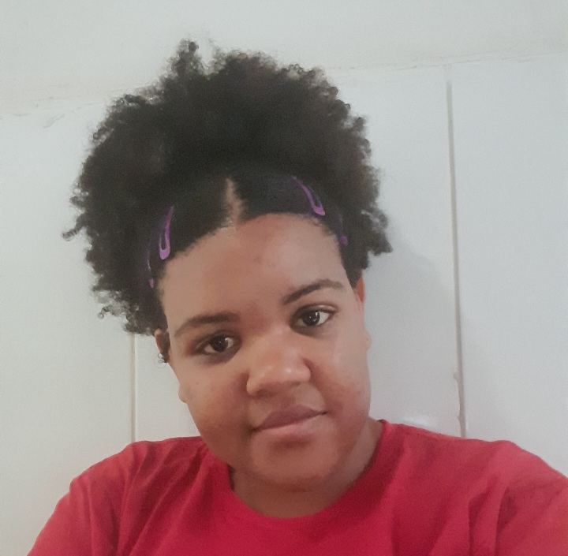

<!DOCTYPE html>

<html lang="pt-br"> 
    <head>
        <meta charset="utf-8">
        <meta name="author" content="Alice Bispo">
    </head>
    <body>
       <h1>Currículo</h1> 
       
       <h2>Dados pessoais</h2>
       
Nome: Alice Bispo dos Santos

       
Data de nascimento: 04/03/2002

       
Nacionalidade: Brasileira

       
Estado civil: Solteira

       
E-mail: alicebispotmi@gmail.com

       

       <h2>Objetivos</h2>
       
Procuro estagio nas áreas de Engenharia de Produção, desenvolvimento Web ou Análise de Dados.

       

       <h2>Formação</h2>
       
 2017 - 2019 Ensino médio completo

       
 2020 - ... Graduanda em Engenhria de Produção

       

       <h2>Qualificações e atividades complementares</h2>
       
Conhecimento em programação: java, javasscript, python, c#, HTML e CSS. 

       
Conhecimento intermediário em excel

       
Atualmente secretaria do WIE UFRB - Women in Engineering

       
Fui coordenadora do NUBBEP - Núcleo Bahiano de Estudantes de Engenharia de Produção

       
Espanhol intermediário

       

       <h2>Contatos</h2>
       
<li><a href="https://www.linkedin.com/in/alice-bispo-498a461a3/" target="_blank"><i class="fab fa-linkedin estilo-icone"></i> Alice-Bispo</a></li>
        <li><a href="https://github.com/AliceBispo" target="_blank"><i class="fab fa-github-square estilo-icone"></i> AliceBispo</a></li>
 
    </body>
</html>
